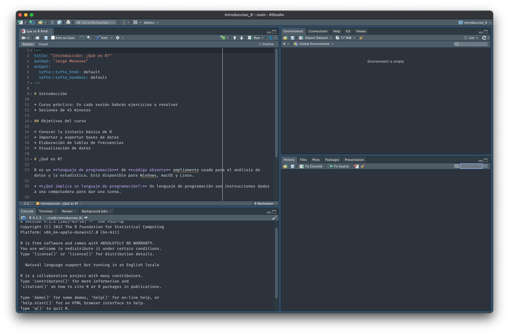

# Introducción

* Curso práctico: En cada sesión habrán ejercicios a resolver
* Sesiones de 45 minutos

## Objetivos del curso

* Conocer la sintaxis básica de R
* Importar y exportar bases de datos
* Elaboración de tablas de frecuencias
* Generación de reportes (Rmarkdown)
* Visualización de datos

# ¿Qué es R?

R es un **lenguaje de programación** de **código abierto** ampliamente usado para el análisis de datos y la estadística. Está disponible para Windows, macOS y Linux.

* **¿Qué implica un lenguaje de programación?:** Un lenguaje de programación son instrucciones dadas a una computadora para dar una tarea.

## ¿Porque usar R?

* R es una herramienta líder para la estadística y el análisis de datos.
* Es un lenguaje de programación independiente del sistema operativo.
* Es de código abierto y gratuito.
* Tiene una gran comunidad de usuarios a nivel global.
* Replicabilidad del análisis: La sintaxis guarda los pasos específicos hechos para generar un análisis. Otros investigadores pueden verificar o replicar los estudios.

## Rstudio

```{r fig.margin = TRUE, echo=FALSE, fig.cap="Rstudio"}

```

Rstudio es la aplicación más usada para desarrollar R. Es lo que se conoce como un **IDE** (Integrated Development Environment, o Entorno de Desarrollo Integrado). Esta aplicación esta diseñada para facilitar el desarrollo de análisis y reportes en R.

# Instalar R y Rstudio

Para seguir con el curso práctico requerimos la instalación de R y Rstudio en nuestras computadoras. La instalación dependerá del sistema operativo que usemos

## Instalar R y Rstudio en Windows

**Descargar e instalar R**

**Descargar e instalar Rstudio**

## Instalar R y Rstudio en macOS

**Descargar e instalar R**

**Descargar e instalar Rstudio**