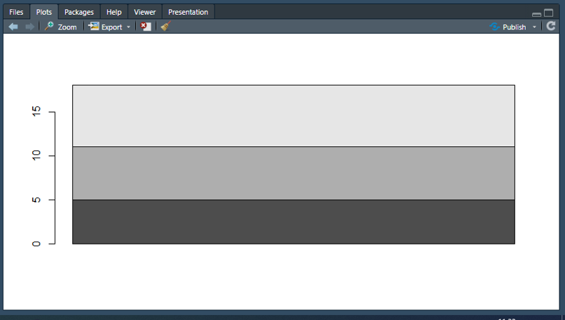
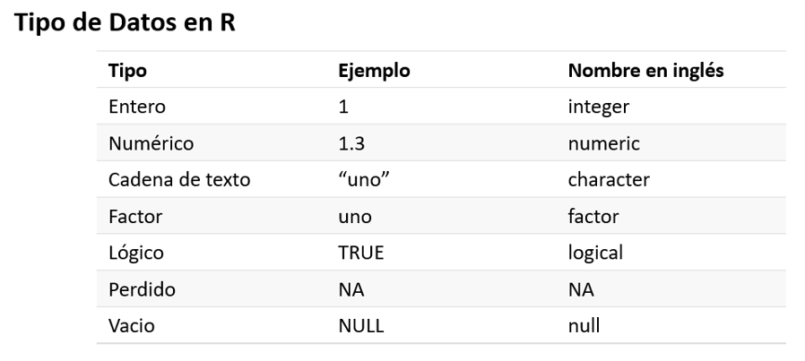
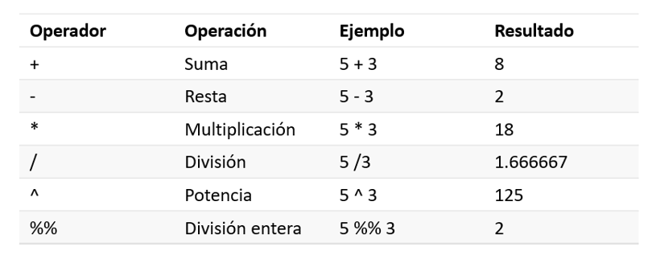

## Rstudio

Rstudio es la principal aplicación para usar R. En esta sesión empezaremos por conocer la interface y como podemos utilizarla.

# Los Paneles de Rstudio

## Paneles

Rstudio tiene los siguientes 4 paneles o áreas claves:

-   **Consola o terminal**: Donde se ejecuta el codigo R y se presentan los resultados de las operaciones que comandamos en el guión.
-   **Editor de Código** (Code editor): es la fuente donde escribes tú código. La información escrita puede ser luego almacenada, modificada y compartida con otros usuarios.
-   **Entorno** (Environment): donde se pueden ver los objetos que vamos creando como tablas, bases de datos o funciones.
-   **Files/Plots/Packages/Help**: donde puedes ver tus archivos de la computadora, gráficos, paquetes (esto lo veremos luego) y archivos de ayuda.

## Consola {.smaller}

<div class="columns-2">

La consola de R es el área donde se presentan los resultados del código que hemos ejecutado. Si hay algún error en el código escrito, la consola nos indicará sobre dicho error. Existen diferentes tipos de errores, pueden ser desde algo simple como un signo de puntuación mal puesto hasta cosas más complejas como falta de archivos en la computadora.

Adicionalmente, también se puede colocar líneas de código directa en la consola y el programa ejecutará los comandos, sin embargo, estas líneas de códigos no serán grabadas.

{width=100%}

</div>

## Editor de Código {.smaller}

<div class="columns-2">

- Donde se crea y edita los códigos de R.
- Archivos se guardan con la extensión ".R", solo son archivos de texto. Los resultados del código se verán en el panel de Consola.
- El guión cuenta el número de línea donde se está escribiend el código.
- Para escribir anotaciones o comentarios en el guión, se debe anteceder la línea con el símbolo "\#". También se puede dividir el guión secciones con "\#####" haciéndo más fácil la navegación dentro del guión.

{width=100%}

</div>

---

El editor de código será nuestro principal espacio de trabajo. Aquí podemos escribir todas las instrucciones para realizar nuestros análisis y reportes.

El guión se puede ejecutar por líneas o completo. Si solo quiere ejecutar unas líneas, se debe seleccionar las líneas deseadas y apretar el botón Enter o también en el extremos derecho del panel se encuentra la opción "Run". Si se desea ejecutar todo un guión, en el extremos derecho del panel se selecciona la opción "Source".

## Entorno o Environment {.smaller}

- Muestra todos los objetos que se han ido creando durante la ejecucción del guión y una descripción breve de cada uno de ellos y sus atributos.
- Por ejemplo, te puede indicar el número de columnas y filas dentro de una tabla.
- Asimismo, dentro del panel hay algunas opciones como guardar el ambiente de trabajo, limpiarlo e importar archivos, aunque no es la mejor opción para ejecutar esta acción.

{width=100%}

## El panel de ayuda, gráficos (plots), archivos {.smaller}

<div class="columns-2">

Muestra los gráficos que se mandan a ejecutar. También en esta sección tiene un explorador para ubicar los archivos que se desean trabajar, así como la lista de paquetes disponibles en R para el análisis de información y una sección de Ayuda ant cualquier pregunta.

{width=100%}

</div>

## Tipo de datos en R

Hay ocho tipo de datos claves con los que se trabajas. A continuación se da una lista de estos datos con sus respectivos ejemplos.

{width=80%}

---

Con este tipo de datos se pueden realizar diferentes tipos de acciones: si los datos son de tipo númerico o integral, estos se puede summar, dividir, restar. Si estamos trabajando con datos de tipo character o factor, estos se pueden agrupar en cadenas de datos. A continuación se muestran los operadores más comunes utilizados para realizar operaciones en R.

## Asignando variables

- Una de las ventajas de R es que nos permite almacenar variables *asignandoles* un nombre específo.
- Para almacenar una variable se usa el signo "\<-" de la siguiente manera:

```{r}
nombre <- "dato"
```

## Algunos ejemplos

```{r}
este_ano <- 2022
numero_pi <- 1.6
mi_nombre <- "Jorge Meneses"
factor <- "uno"
es_tarde <- TRUE

# Valores especiales
vacio <- NULL
perdido <- NA
```

- Estas variables quedan almacenadas en el entorno de trabajo
- Para verlas, podemos escribir en la consola o en el guión el nombre asignado
- Un objeto puede tener cualquier nombre, con la condición que no empiece con un número o un guión bajo. Se recomienda usar nomrbes descriptivos y con minúsculas

## Operadores

{width=80%}

---

- Los operadores pueden usarse con cualquier tipo de objeto, este almacenado o no.
- El resultado de un operador puede asignarse a otro objeto.

## Ejemplos {.smaller}

```{r}
2 + 2 # 4
5 - 1 # 4
5 * 5 # 25
40 / 6 # 6.6666666667
```

---

```{r}
2^5 # 32
5 %% 3 # 2

ano_nacimiento <- 1986
ano_actual <- 2022
edad <- ano_actual - ano_nacimiento
edad
```


## Tarea para próxima sesión

- Crear un guión con un conjunto de variables, cada tipo revisado en la clase excepto factor.
- Asimismo crear cuatro variables en base a las siguientes operaciones básicas (suma, resta, multiplicación, dvisión y potencia).
- Grabar el guión con su Nombre_Apellido_Tarea1 y enviarlo al correo del instructor.
