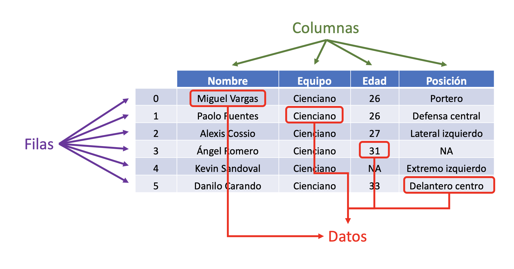

## Estructuras de Datos

- Hasta el momento hemos visto tipos de datos básicos (cadenas de textos, enteros, númericos, valores lógicos)
- Las estructuras de datos son formas particulares de organziar la información para usarla de forma más efectiva
- Veremos 3 estructuras:

1. Vectores
2. Listas
3. Tablas de datos (*Data Frames*)

## Vectores {.smaller}

Los vectores son una colección de datos del **mismo tipo**. Es decir, son homogéneos.

```{r}
# Vector numérico
numeros_primos <- c(2, 3, 5, 7)

# Vector de texto
paises <- c(
    "Perú",
    "Ecuador",
    "Bolivia"
)

# Muestra el vectores en la consola
numeros_primos
paises
```

---

El comando typeof nos permite verificar el tipo de dato del vector

```{r}
typeof(numeros_primos)
typeof(paises)
```

## Listas {.smaller}

Listas son una colección **ordenada** de datos de **diferentes tipo**.

```{r}
# Mis datos
yo <- c("Jorge Meneses", 36, "Sociología")

yo
```

---

Se pueden crear listas usando el comando `list()`

```{r}
gaseosas <- list(
    "Coca-cola",
    "Pepsi",
    "Fanta"
)

gaseosas
```

## Largo (lenght) datos

Los vectores y listas tienen un largo que es igual a la cantidad de objetos que tienen. Para ver el largo de un objeto usamos el comando `lenght()``

```{r}
length(numeros_primos)
length(paises)
```

## Accediendo datos

Tanto en listas como vectores podemos acceder a cada uno de los datos de forma individual. Para eso necesitamos indicar el **índice**.

```{r}
# Accediendo un vector
numeros_primos[4]

# Accediendo una lista
gaseosas[2]
```

## Modificando datos {.smaller}

Podemos cambiar un dato particular de un vector o lista volviendolo a asignar

```{r}
gaseosas <- list(
    "Coca-cola",
    "Pepsi",
    "Fanta"
)

# Reasignando segundo elemento
gaseosas[2] <- "Inka Kola"

# Mostrando contenido final
gaseosas
```

---

También podemos ordenar los vectores de forma ascendente o descentente

```{r}
# Creando vector
numeros_desordenados <- c(89, 132, 1, 7, 21, 42)

# Ordenando ascendente
numeros_ascendente <- sort(numeros_desordenados)

# Ordenando descendente
numeros_descendente <- sort(numeros_desordenados, decreasing = TRUE)

numeros_ascendente
numeros_descendente
```

---

También se pueden ordenar vectores de texto

```{r}
# Mostrando lista
paises

paises_ordenados <- sort(paises)
paises_desc <- sort(paises, decreasing = TRUE)

paises_ordenados
paises_desc
```

## Listas nombradas

Los valores de las listas pueden estar nombrados

```{r}
id_empleados <- c(1, 2, 3, 4, 5)
nombre_empleados <- c("Ana", "Bernardo", "Cintia", "David", "Emilia")

names(id_empleados) <- nombre_empleados

id_empleados
```

## combinar listas

Dos listas se pueden combinar usando el comando `c()`

```{r}
ciudades_1 <- c("Arequipa", "Huancayo", "Piura")
ciudades_2 <- c("Ayacucho", "Puno", "Huancavelica")

ciudades_3 <- c(ciudades_1, ciudades_2)

ciudades_3
```

## Tablas (Data Frames) {.smaller}

- Los *data frames* o tablas son ordenamiento de datos de forma tabulada.
- Son la forma más popular de ordenar datos en R.
- Tienen 2 dimensiones: filas y columnas

{width=80%}

## Características

- Las columnas deben estar nombradas.
- Cada columna debe tener el mismo número de elementos.
- Cada elemento en una columna debe ser del mismo tipo (Cada columna es un vector)
- Diferentes columnas pueden tener diferentes tipos de datos.

## Crear un data frame

```{r}
nombres <- c("Alberto", "Bertha", "Camila")
edad <- c(15, 75, 34)
ciudad_nacimiento <- c("Cusco", "Lima", "Puno")
hijos <- c(TRUE, FALSE, FALSE)

tabla <- data.frame(nombres, edad, ciudad_nacimiento, hijos)

tabla
```

---

Rstudio nos permite visualizar una tabla de forma más amigable con el comando `View()`

```{r}
View(tabla)
```

Podemos ver la estructura de la tabla con el comando `str()`

```{r}
str(tabla)
```

---

Usando el comando `summary()` podemos pedirle a R que nos de un resumen de la información de la tabla

```{r}
summary(tabla)
```

---

El comando `dim()` nos indica las dimensiones de nuestro data frame

```{r}
dim(tabla)
```

---

Si tenemos tablas grandes podemos usar `head()` y `tail()` para ver solo los primeros (head) o últimos (tail) datos de nuestra tabla

```{r}
# Cargamos una data de ejemplo de R
data(USArrests)

head(USArrests)
```

---

```{r}

tail(USArrests)
```

---

Podemos accesar a los vectores individuales de la tabla usando el nombre de la columna

```{r}
tabla$nombres

tabla$edad
```

## Nombres de columnas {.smaller}

Las columnas de un dataframe estan nombradas. Podemos usar el comando `names()` para extraer los nombres y para cambiarlos

```{r}
# Extrae nombres del data frame
names(tabla)

# Creamos un nuevo vector con nuevos nombres
nuevos_nombres <- c("Nombre completo", "Edad", "Ciudad de Nacimiento", "¿Tiene hijos?")

# Asignamos nuevos nombres a tabla
names(tabla) <- nuevos_nombres

# Verificamos cambio
names(tabla)
```

## Ejercicio

Crear un data frame de su familia. El data frame debe contener las siguientes columnas:

- Nombre Completo (cadena de texto)
- Edad (Número entero)
- Altura (Número decimal)
- ¿Está Casado? (Valor lógico, TRUE/FALSE)

Los nombres de las columnas deben cambiarse:

- Ej: en lugar de `nombre` debe decir **"Nombre Completo"**


# Glosario

## Combinar

```{r}
# Combina elementos en un objeto
abecedario <- c("a", "b", "c")

notas <- c(15, 20, 08)
```

## Imprimir

```{r}
# Imprime el objeto en la consola
x <- 5
print(x)
```

## Crear una lista

```{r}
# Crea una lista

presidentes <- list("Ollanta", "PPK", "Vizcarra")
```

## typeof

El comando `typeof()` nos permite ver el tipo de un vector

```{r}
vector2 <- c(1L, 4L, 2L, 5L)
typeof(vector2)
```

## names

Extrae los nombres de un vector o los asigna

```{r}
nombres <- c("Jorge", "Karla", "Luis")
edad <- c(36, 45, 18)

# Asigna nombres al vector
names(edad) <- nombres

# Extrae los nombres del vector
names(edad)
```